LYRASIS uses SumoLogic to aggregate DuraCloud logs in order to better understand what is happening in the DuraCloud system. The following is an overview of the types of charts developed for monitoring DuraCloud systems, as an example of use.

Details to be added:

* An overview of the information contained in DuraCloud logs
* Configuring SumoLogic to capture and parse DuraCloud logs
* Creating SumoLogic dashboards for DuraCloud data

# A Tour of the SumoLogic Graphs

## DuraCloud I/O

### Bytes added by account
Shows the number of bytes added by account within a specified time period *as a time series* (last
  seven days by default).

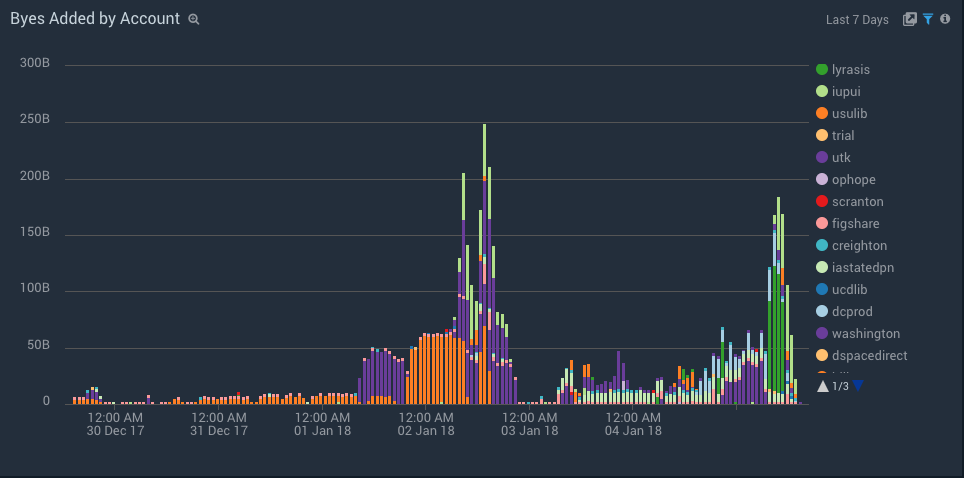

### Total bytes added by account over the last week.
Shows the *sum* of all bytes added by account within a specified time period (last
  seven days by default).

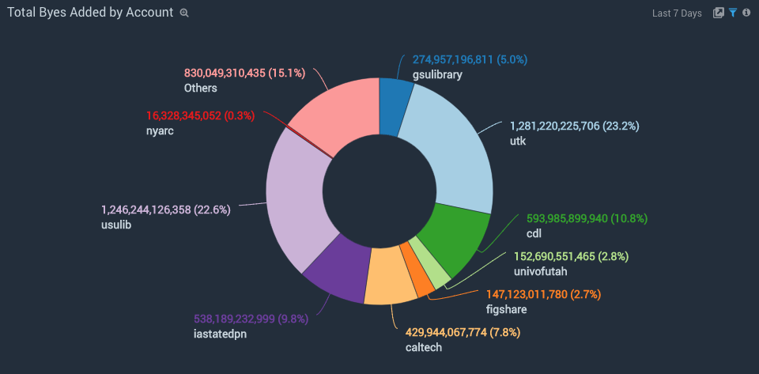

### Bytes deleted by account
Shows the number of bytes deleted by account within a specified time period *as a time series* (last
  seven days by default).

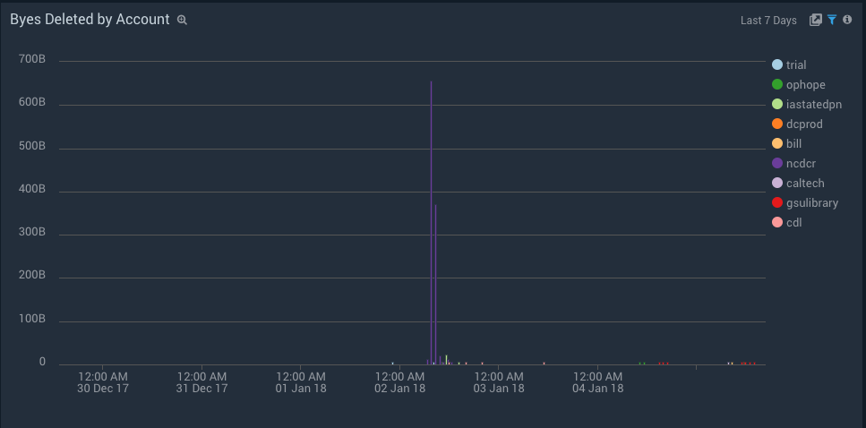

### Total bytes deleted by account over the last week.
Shows the *sum* of all bytes deleted by account within a specified time period (last
  seven days by default).

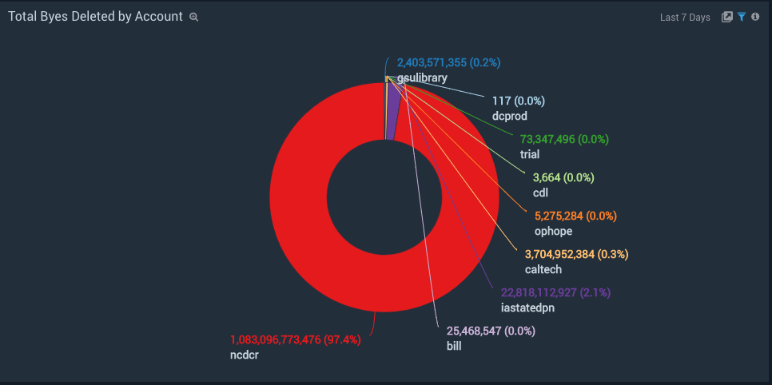

### Files added by account
Shows the number of files added by account within a specified time period *as a time series* (last
  seven days by default).

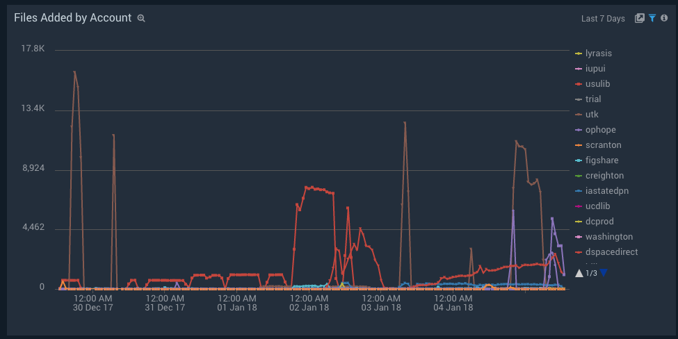

### Total files added by account over the last week.
Shows the *sum* of all files added by account within a specified time period (last
  seven days by default).

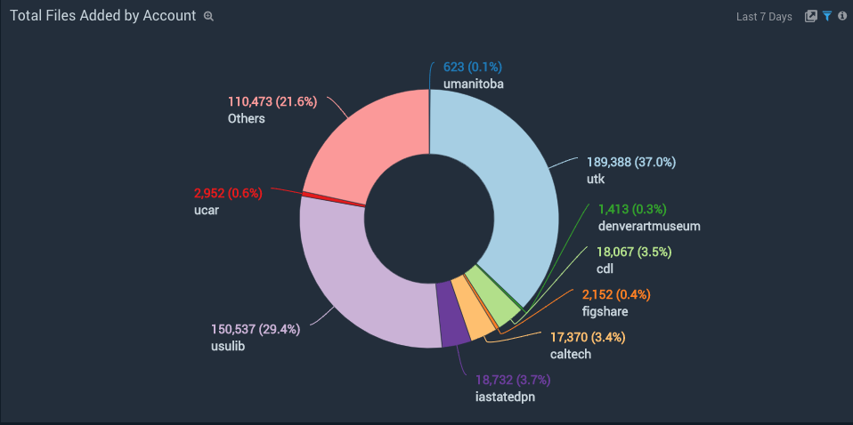

### Files deleted by account
Shows the number of files deleted by account within a specified time period *as a time series* (last
  seven days by default).

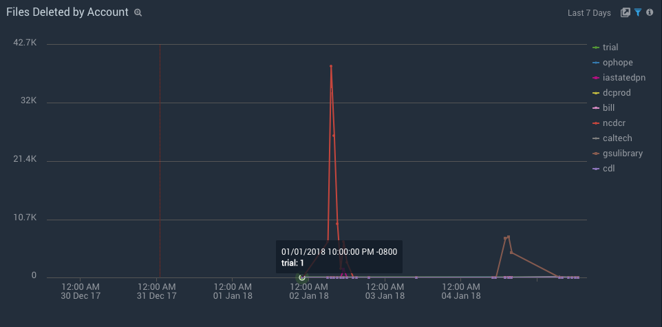

### Total files deleted by account over the last week.
Shows the *sum* of all files deleted by account within a specified time period (last
  seven days by default).

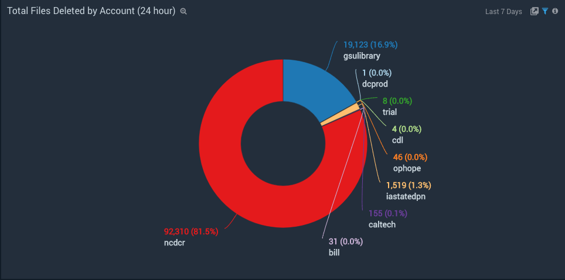

## DuraCloud Mill

### General errors
Shows the count of errors occurring in five minute intervals over the last 24 hours.

### _Tasks_

### Task processing failures over time
Shows the count of task processing failures over five minute intervals over the last 24 hours. If a task fails twice 
and the succeeds on the third retry, it would show up here as two failures.  So it is expected that failures will occur.
Failures that exceed the number of retries will go into the Dead Letter Queue which has its own graph.  Notice
that the failures are broken out by *processor type*.

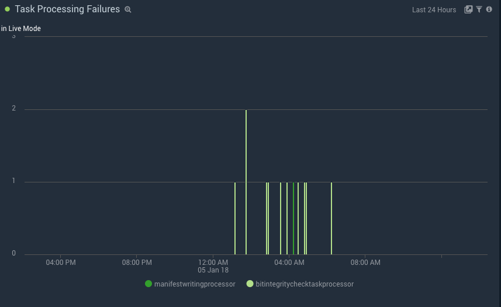

### Count of configured threads over time
This graph shows the total number of threads that should be available to the mill instance for running tasks.
It is broken out by workman type to give further insight into what is the theorectical capacity for each task type.
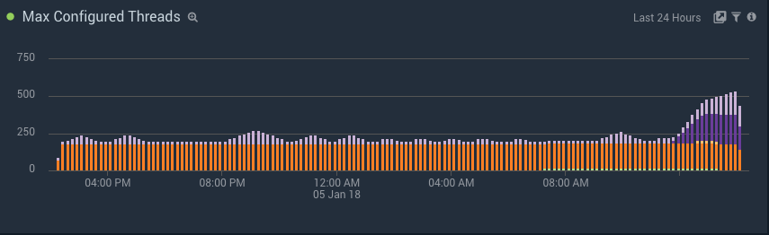

### Total tasks processed over time
This graph shows the total number of tasks prcoessed summed by task over five minute intervals over the last 24 hours.

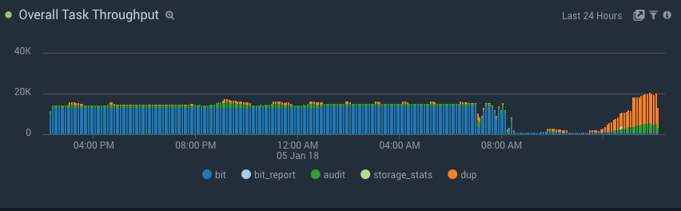

### The total number of running threads
Shows the total of the threads actively working on tasks summed over five minute intervals over the last 24 hours.

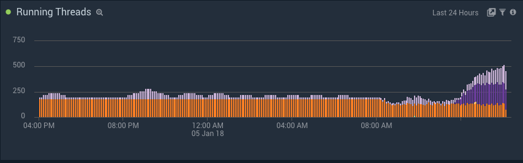

### Workman instance count 
Shows the total number of workman instances summed over five minute intervals over the last 24 hours broken out by 
worker type.  These number should correspond to the number of autoscaled instances of each worker type.

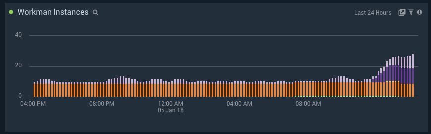

### Audit task queue size over time
Shows the size of the queue averaged over five minute intervals over the last 24 hours.

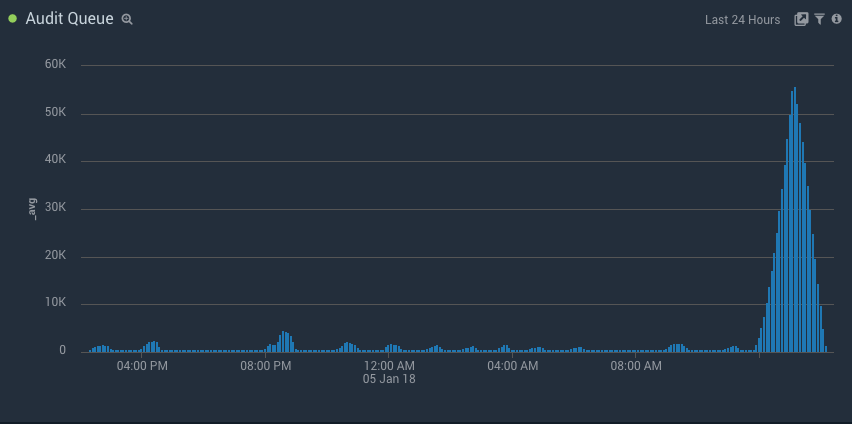

### Audit task throughput over time
Shows the number of audit tasks processed over the last 24 hours as a time series.

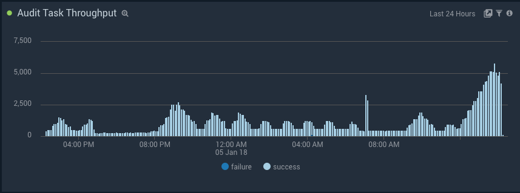

### Average audit task processing duration size over time
Shows the average elapsed time for the processing of audit tasks over the last 24 hours as a time series.
It is notable this graph shows the total time per task as well as average of individual sub task processors including
the audit task processor as well as the manifest task processor.  Breaking the times out by subtype help identify 
bottlenecks affecting particular sub-processes.

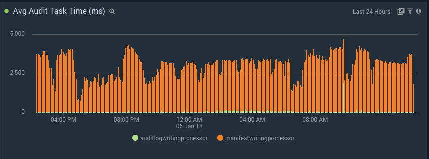

### High priority dup task queue size over time
Shows the size of the high priority duplication queue averaged over five minute intervals over the last 24 hours.

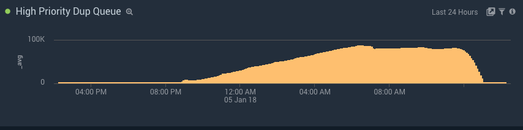

### Low priority dup task queue size over time
Shows the size of the low priority duplication queue averaged over five minute intervals over the last 24 hours. 
When a duplication run is underway, you would expect to see lots of items in this queue.

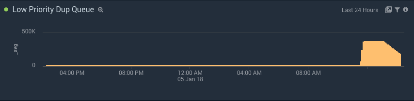

### Dup task throughput over time
Shows the number of duplication tasks processed over the last 24 hours as a time series.

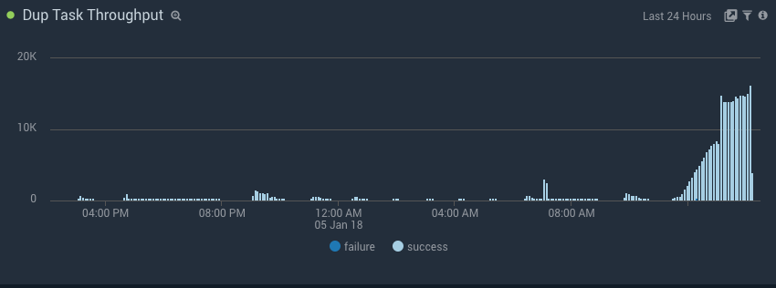

### Average dup task processing duration size over time
Shows the average elapsed time for the processing of dup tasks over the last 24 hours as a time series. 

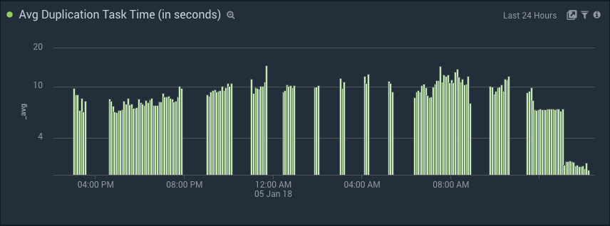

### Bit task queue size over time
Shows the size of the bit integrity task queue averaged over five minute intervals over the last 24 hours. 
When a bit integrity run is underway, you would expect to see lots of items in this queue.

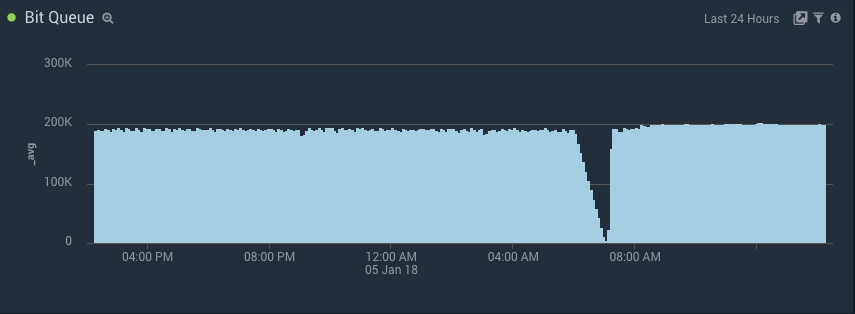

### Bit task throughput over time
Shows the number of bit integrity tasks processed over the last 24 hours as a time series.

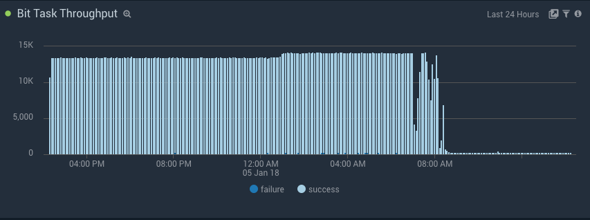

### Bit task throughput by retries  over time
This graph shows the number successful of bit integrity tasks processed over the last 24 hours as a time series grouped by 
the retry on which the task succeeded.  In other words,  this graph will tell you how efficiently the system is processing
logical tasks.  If you start to see lots of successes after three retries and almost no successes after one retry then 
that might point to a problem with the reliability of the network.

### Average bit integrity task processing duration size over time
Shows the average elapsed time for the processing of bit integrity tasks over the last 24 hours as a time series. 

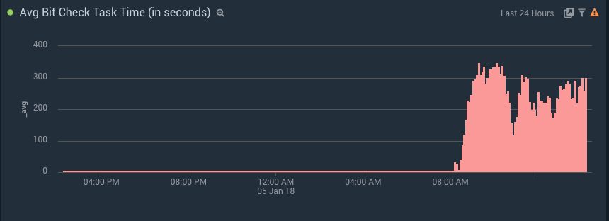

### Bit report tasks throughputover time
This graph shows the number successful and failed bit integrity report tasks processed over the last 24 hours as a time 
series.  If you see no activity here while the bit integrity producer graph shows more than one account being processed
it may indicate that there is a problem with the bit report task worker.

###_Other Processes_

### Audit log generator activity
This graph shows the flow of audit log items that were read from the audit database and written to the audit log space.
The main function is simply to verify that this process,  which should be writing new audit entries as long as objects
are being uploaded to DuraCloud, is running as expected.

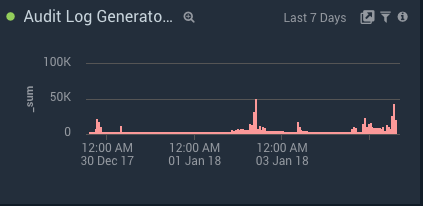

### Manifest Cleaner (deleted item purger) activity
This graph shows the count of manifest entries being purged from the manifest table over time.  The amount of time 
a manifest entry remains in the database after being flagged as deleted is configured in the mill-config.properties 
file.  The default is one day.  So if you delete some items, you would expect to see those deletes purged one day later
in this graph.

### Duplication producer activity 

This graphs shows the number of dup tasks that the duplication producer has placed on the queue over the last three days by 
account.

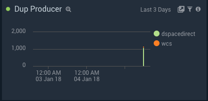

### Bit integrity producer activity 

This graphs shows the number of bit integrity tasks that the bit integrity producer is placing on the queue over the 
last three days by account.

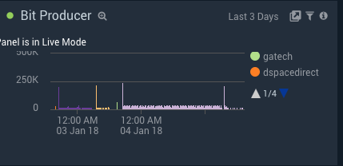
